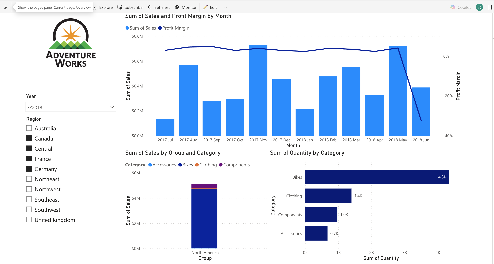

# 🚴 AdventureWorks Sales Analysis – Power BI Dashboard

## 📌 Project Overview
This Power BI report provides an analytical view of **AdventureWorks sales performance**, focusing on revenue trends, product category breakdowns, and regional insights.  
The dashboard enables users to explore monthly sales and profit margins, compare product category performance, and analyze the distribution of sales and quantities across different regions.

---

## 📊 Dashboard Features

### **1. Sales & Profit Margin by Month**
- Column chart showing **monthly sales** performance.
- Line chart overlay displaying **profit margin trends**.
- Highlights seasonality, revenue peaks, and margin fluctuations.

### **2. Sales by Group and Category**
- Stacked bar visualization comparing **sales distribution by group** (e.g., North America).
- Breakdown of product categories:
  - Accessories  
  - Bikes  
  - Clothing  
  - Components  

### **3. Quantity by Product Category**
- Horizontal bar chart showcasing **total quantity sold** for each product category.
- Helps identify high-volume items (e.g., Bikes as the leading category).

### **4. Slicer Filters**
- **Year filter** (e.g., FY2018)
- **Region filter** including:
  - Australia  
  - Canada  
  - France  
  - Germany  
  - Northeast  
  - Northwest  
  - Southeast  
  - Southwest  
  - United Kingdom  
  - Central  

These slicers allow interactive exploration of the dataset.

---

## 🧩 Data Model
The dataset includes fields related to:
- **Sales transactions**
- **Product categories**
- **Regions**
- **Time intelligence (Year, Month)**

Power BI relationships allow filtering and aggregation across:
- Product  
- Geography  
- Dates  
- Sales facts  

---

## 🔍 Key Insights
- Highest sales months show strong alignment with **high-volume categories** such as Bikes.
- Profit margins present fluctuations even when sales volume is high, indicating **variability in category profitability**.
- North America emerges as the **dominant sales group**.
- Quantity distribution confirms Bikes as the most sold product type.

---

## 📁 Project Files
- `08-Starter-Sales Analysis_AdventureWorks.pbix`  
- `04-Starter-Sales Analysis_adventureWorks_datasets.pbix` 
- `README.md`  
- `Images folder`

---

## ▶️ How to Use
1. Download the `.pbix` file from the repository.  
2. Open it with **Power BI Desktop** (Windows required).  
3. Interact with slicers to explore:
   - Yearly performance  
   - Regional variation  
   - Category distribution  

---

## 🚀 Future Improvements
- Add drill-through pages for product-level analysis.
- Incorporate forecasting for upcoming sales periods.
- Enhance design using bookmarks and KPI indicators.

---

## 👤 Explore my Power BI project:

🔗 [Visit the link](https://app.powerbi.com/groups/me/reports/b8e65d91-89ff-40e0-84dc-129c716ec7aa/ReportSection?experience=power-bi)

---

## 📎 Screenshot Preview
Below is a preview of the dashboard included in the project:

